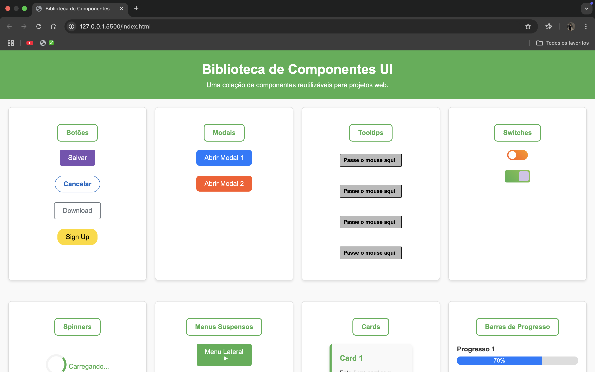
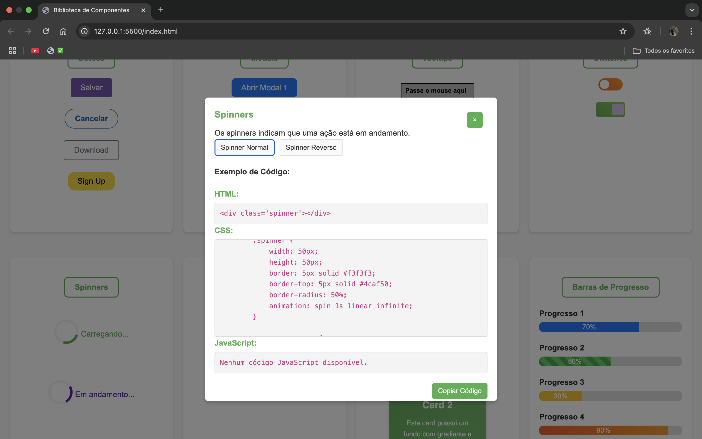

# Biblioteca-de-Componentes
# 📚 Documentação Técnica Interativa

Uma página web desenvolvida para simular uma documentação técnica, com foco em boas práticas de desenvolvimento front-end, responsividade, interatividade e experiência do usuário.

 
 

---

## 🚀 Tecnologias Utilizadas

- ✅ **HTML5** — Estrutura semântica e acessível
- ✅ **CSS3** — Estilização moderna com foco em UI/UX
- ✅ **Responsividade** — CSS Grid, Flexbox e media queries
- ✅ **Interatividade (JavaScript)** — Pop-ups, botões de cópia e feedbacks visuais

---

## 🎯 Objetivo

Este projeto foi desenvolvido como parte do meu portfólio front-end com os seguintes propósitos:

- Consolidar conhecimentos em desenvolvimento web utilizando HTML e CSS.
- Aplicar práticas modernas de responsividade e design.
- Simular uma aplicação real de documentação técnica, frequentemente usada por desenvolvedores e empresas.
- Demonstrar habilidades em organização de código, semântica, acessibilidade e experiência do usuário.

---

## ✨ Funcionalidades

- 📄 Layout limpo, organizado e responsivo
- 💻 Seções bem definidas, simulando uma documentação técnica
- 🔲 Pop-up interativo para exibir blocos de código
- 📋 Botões de cópia funcional com feedback visual
- 🎨 Estilização moderna e agradável
- 📱 Totalmente adaptado para dispositivos móveis, tablets e desktops

---

## 🗂️ Estrutura do Projeto

```plaintext
/
├── index.html           # Página principal
├── css/
│   └── style.css        # Estilos do projeto
├── js/                  # Scripts (opcional)
│   └── script.js
├── imgs/                 # Imagens utilizadas
│   └── previews.png
└── README.md            # Documentação do projeto

## 🌐 Deploy
O projeto pode ser acessado diretamente em:
➡️ [Acesse aqui o deploy do projeto](#)

---

## 📱 Responsividade
- ✔️ **Desktop**
- ✔️ **Tablet**
- ✔️ **Mobile**

O layout foi projetado utilizando **CSS Grid**, **Flexbox** e **media queries**, garantindo uma ótima experiência do usuário em diferentes tamanhos de tela.

---

## 🧠 Aprendizados
Durante o desenvolvimento deste projeto, aprofundei conhecimentos em:
- Estruturação semântica de páginas HTML.
- Estilização moderna com foco em UX/UI.
- Criação de layouts responsivos do zero.
- Implementação de interatividade com JavaScript puro.
- Organização de código limpo e escalável.
- Melhores práticas em desenvolvimento front-end.

---

## 🔍 Próximas Melhorias (Backlog)
- ✅ Adicionar temas (dark/light).
- 🔲 Implementar busca interna dentro da documentação.
- 🔲 Transformar em um template reutilizável para futuros projetos.
- 🔲 Melhorar acessibilidade com ARIA e navegação via teclado.

---

## 🤝 Contribuindo
Contribuições são sempre bem-vindas!  
Sinta-se à vontade para abrir uma **issue**, propor melhorias ou realizar um **pull request**.

---

## 👨‍💻 Sobre Mim
Desenvolvedor Front-End em formação, apaixonado por tecnologia, design e soluções criativas.  
Estou em constante aprendizado, buscando oportunidades para colaborar com projetos desafiadores e inovadores.

- 🌐 [Meu Portfólio](#)
- 💼 [LinkedIn](#https://www.linkedin.com/in/pedro-eyer-104097266/)
- 🐙 [GitHub](#https://github.com/Pedro-Eyer)
